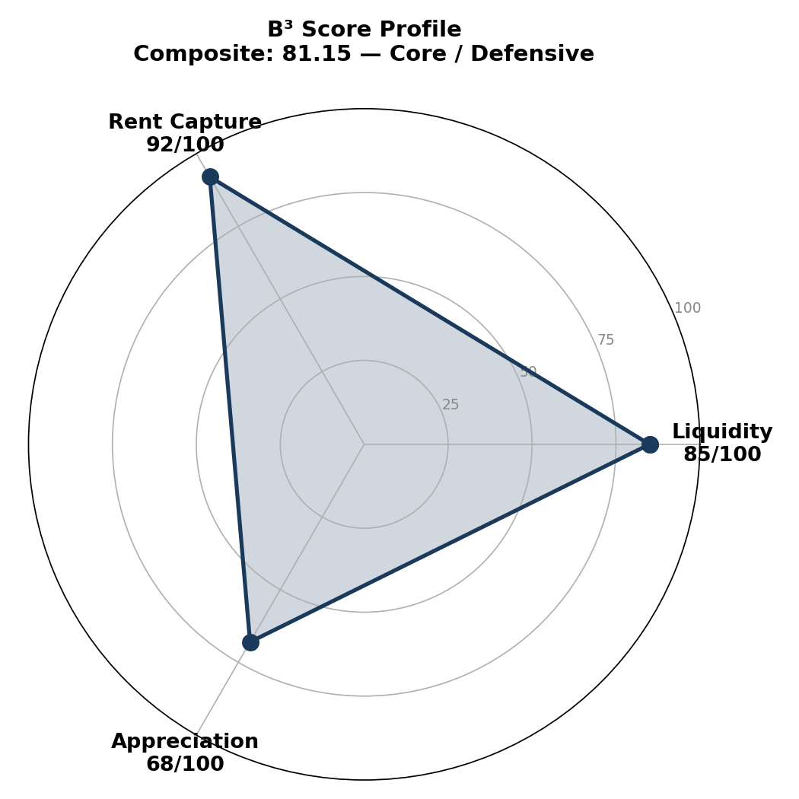

# B³ Building Analyzer

**NYC 콘도 건물 투자 분석 AI 스킬** — 거래 데이터를 넣으면 B³ (Building Block Benchmark) 스코어링과 투자 테마를 자동으로 생성합니다.



## B³란?

B³ (Building Block Benchmark)는 NYC 콘도 건물을 세 가지 축으로 평가하는 투자 분석 프레임워크입니다:

| 축 | 측정 대상 | 가중치 |
|---|---|---|
| **Liquidity** | 얼마나 빨리 팔리는가 (DOM) | 35% |
| **Rent Capture** | 얼마나 높은 임대료를 받는가 (Rent PPSF) | 30% |
| **Appreciation** | 장기 가격 상승률 (CAGR) | 35% |

세 지표를 **따로 보지 않고 교차 분석**하여 "이 건물은 어떤 투자자에게, 왜 적합한가"를 도출합니다.

## 빠른 시작

### OpenClaw 설치

```bash
# 1. 스킬 폴더로 클론
git clone https://github.com/YOUR_USERNAME/b3-building-analyzer.git \
  ~/.openclaw/workspace/skills/b3-building-analyzer

# 2. 의존성 설치 (Python)
pip install pandas matplotlib

# 3. 게이트웨이 재시작
openclaw gateway restart

# 4. 스킬 확인
openclaw skills list | grep b3
```

### Claude (claude.ai) 설치

1. [Releases](../../releases) 에서 `b3-building-analyzer.skill` 파일을 다운로드
2. Claude 대화창에 드래그 앤 드롭
3. 완료

### Claude Code 설치

```bash
git clone https://github.com/YOUR_USERNAME/b3-building-analyzer.git \
  /path/to/your/project/.claude/skills/b3-building-analyzer
```

## 사용법

스킬이 설치되면 자연어로 요청하면 됩니다:

```
이 건물 B³ 분석해줘
[거래 데이터 파일 첨부 또는 붙여넣기]
```

### 지원하는 입력 형태

| 형태 | 예시 |
|------|------|
| CSV / Excel | StreetEasy 또는 ACRIS에서 다운로드한 거래 기록 |
| 텍스트 붙여넣기 | `Unit 6E \| 2 BR \| $3,554,000 \| Sold May 2021` |
| JSON | 구조화된 거래 데이터 |
| 블로그 URL | YRE 블로그 포스트 링크 |

### 출력 형태

- **블로그 포스트** (HTML/Markdown) — 차트 포함 10-section 분석
- **PDF 리포트** — 커버 페이지 + 차트 + 스코어카드
- **PPTX 덱** — 12-15 슬라이드 투자자용 프레젠테이션

## 파일 구조

```
b3-building-analyzer/
├── SKILL.md                          # 메인 스킬 지시서 (7단계 워크플로우)
├── references/
│   ├── b3-methodology.md             # B³ 스코어링 공식 & 분류 로직
│   ├── input-parsing.md              # 입력 포맷별 파싱 가이드
│   └── output-templates.md           # 블로그/PDF/PPTX 템플릿
├── scripts/
│   └── parse_transactions.py         # 거래 데이터 파서 (CSV/Excel/JSON/Text)
└── examples/
    ├── sample-transactions.csv       # 샘플 데이터
    └── b3-radar-sample.png           # 레이더 차트 예시
```

## B³ 스코어링 기준 요약

### Liquidity (유동성)

| Median DOM | 기본 점수 |
|-----------|-----------|
| ≤ 30일 | 90–100 |
| 31–60일 | 75–89 |
| 61–90일 | 60–74 |
| 91–120일 | 45–59 |
| 121–180일 | 30–44 |
| > 180일 | 0–29 |

### Rent Capture (임대 수익력)

| Rent PPSF | 기본 점수 |
|----------|-----------|
| ≥ $100/SF | 90–100 |
| $80–$99/SF | 75–89 |
| $60–$79/SF | 60–74 |
| $45–$59/SF | 45–59 |
| < $45/SF | 0–44 |

### Appreciation (가격 상승)

| CAGR | 기본 점수 |
|------|-----------|
| ≥ 6% | 90–100 |
| 4–5.9% | 75–89 |
| 2–3.9% | 60–74 |
| 0–1.9% | 40–59 |
| 음수 | 0–39 |

### 건물 분류

| 분류 | 조건 | 이상적 투자자 |
|------|------|-------------|
| **Core / Defensive** | Composite ≥ 75, 모든 축 ≥ 55 | 안정 추구형, 패밀리 오피스 |
| **Core Plus** | Composite ≥ 70, 2개 축 ≥ 75 | 균형형 투자자 |
| **Value-Add** | Composite 55–74, 1개 축 ≥ 75 & 1개 축 < 60 | 적극적 밸류에드 투자자 |
| **Opportunistic** | Composite 40–54 | 촉매 기반 투기적 투자자 |
| **Distressed** | Composite < 40 | 딥밸류 / 턴어라운드 전문가 |

## 분석 예시

실제 분석 결과: [45 Christopher Street — B³ Analysis](https://blog.yeonyc.com/45-christopher-street)

```
Building:    45 Christopher Street, West Village
Type:        Pre-war Condo (1931), 112 Units, 17 Floors

Liquidity:     85/100  (Median DOM 47 days)
Rent Capture:  92/100  ($100-$123/SF)
Appreciation:  68/100  (E-line 4.8% CAGR, B-line 1.5% CAGR)
─────────────────────────────────
COMPOSITE:     81.15
Category:      Core / Defensive

Thesis: 유동성 + 임대수익 동시 엘리트 → "Income Fortress"
        리스크 회피형 투자자에게 최적
```

## 커스터마이징

### 스코어링 기준 변경

`references/b3-methodology.md`의 점수 밴드와 가중치를 수정하면 됩니다. 예를 들어 임대 수익을 더 중시하려면:

```
Composite = (Liquidity × 0.30) + (Rent Capture × 0.40) + (Appreciation × 0.30)
```

### 분석 대상 확장

현재는 NYC 맨해튼 콘도에 최적화되어 있습니다. 다른 시장에 적용하려면:
- `b3-methodology.md`의 Rent PPSF 밴드를 해당 시장에 맞게 조정
- `input-parsing.md`의 데이터 품질 체크 범위를 수정

## 라이선스

MIT License — 자유롭게 사용, 수정, 재배포 가능합니다.

## 기여

이슈나 PR 환영합니다. 특히:
- 새로운 입력 포맷 지원 (예: Zillow, Redfin export)
- 추가 시장 벤치마크 데이터
- 출력 템플릿 개선

---

**Built by [YRE](https://www.yeonyc.com)** — NYC 부동산 데이터 기반 투자 분석
