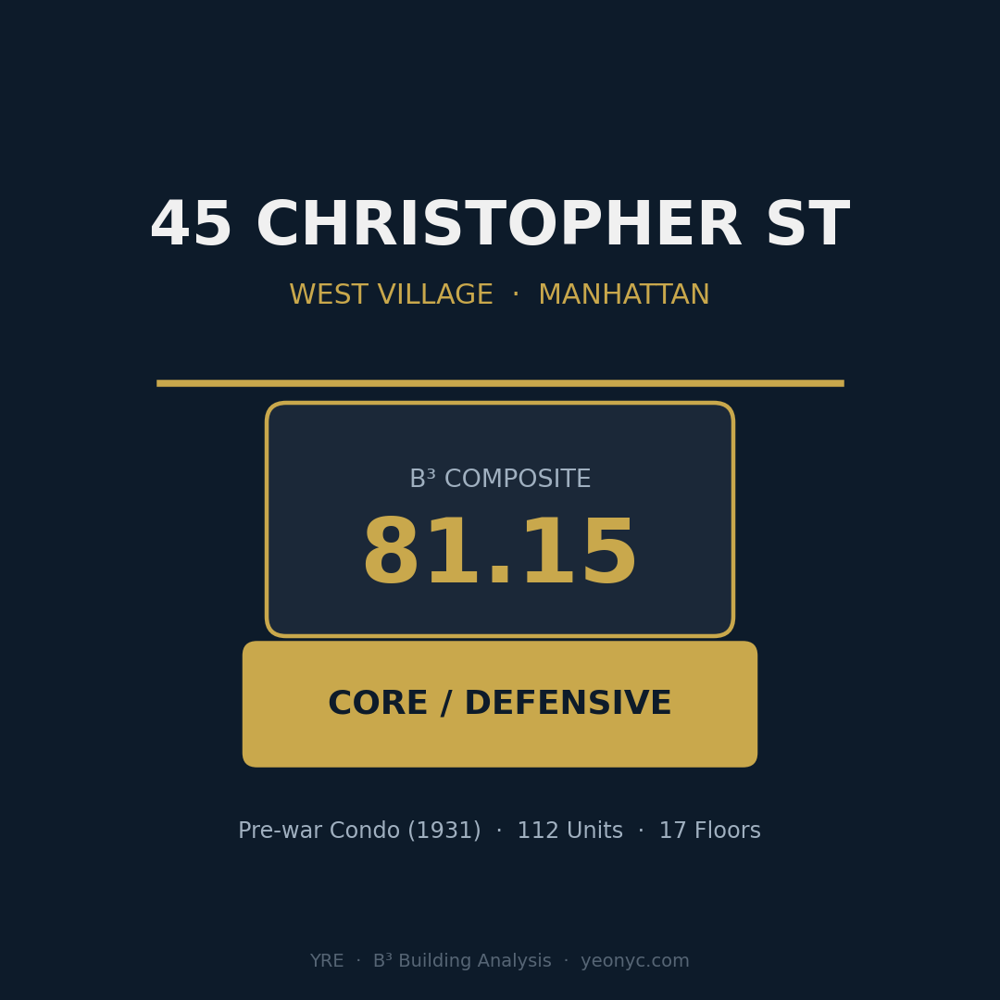
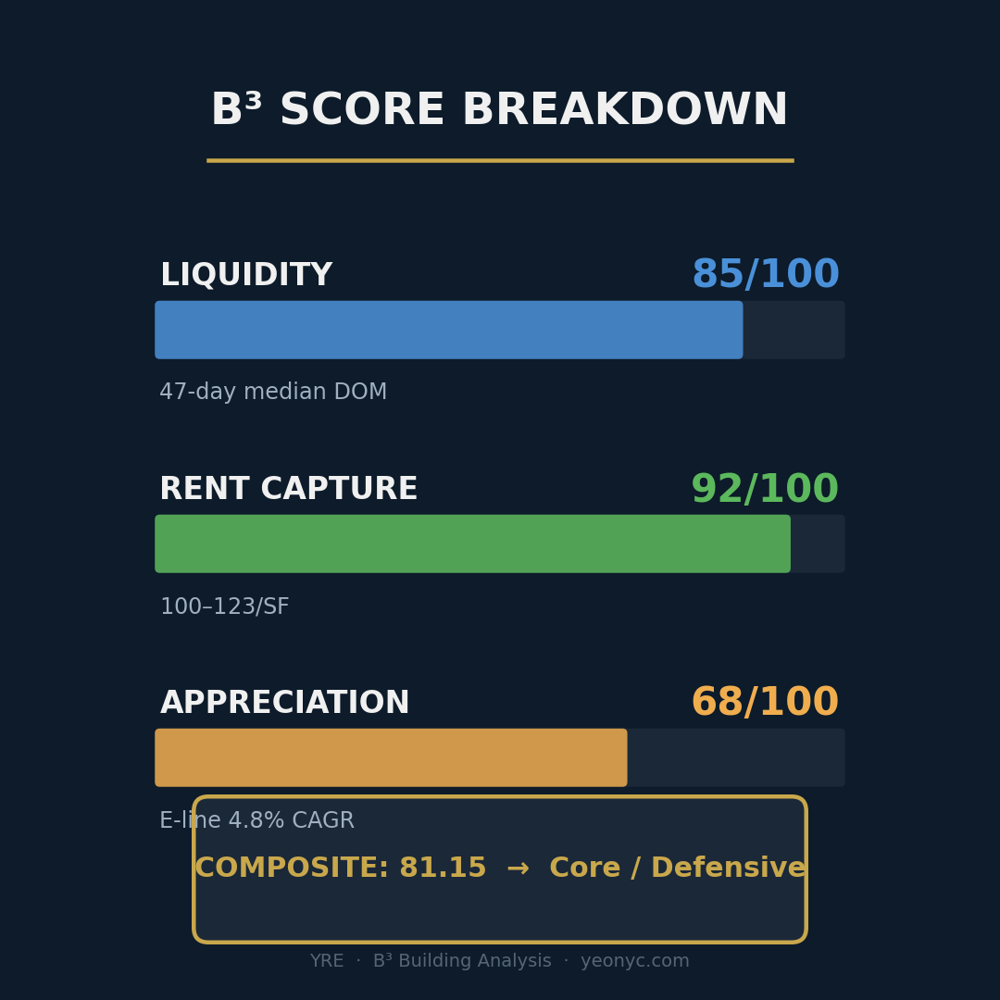
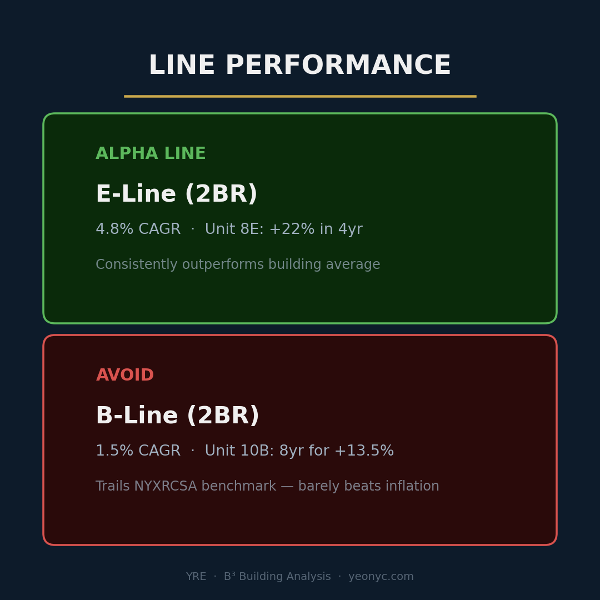
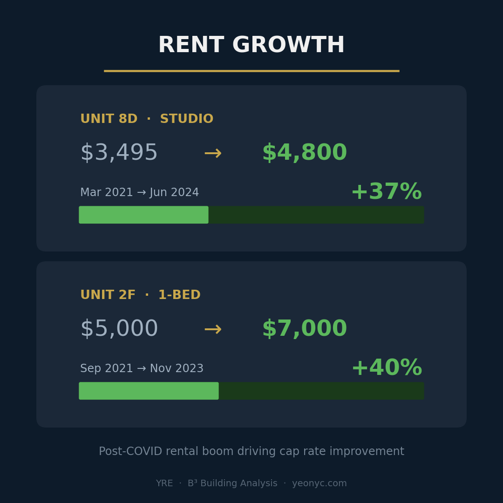
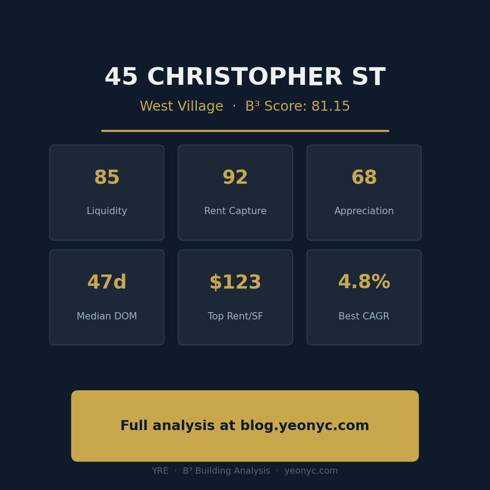

# B³ Building Analyzer

**NYC 콘도 건물 투자 분석 AI 스킬** — 거래 데이터를 넣으면 B³ (Building Block Benchmark) 스코어링과 투자 테마를 자동으로 생성합니다.


## B³란?

B³ (Building Block Benchmark)는 NYC 콘도 건물을 세 가지 축으로 평가하는 투자 분석 프레임워크입니다:

| 축 | 측정 대상 | 가중치 |
|---|---|---|
| **Liquidity** | 얼마나 빨리 팔리는가 (DOM) | 35% |
| **Rent Capture** | 얼마나 높은 임대료를 받는가 (Rent PPSF) | 30% |
| **Appreciation** | 장기 가격 상승률 (CAGR) | 35% |

## 이 스킬이 해결하는 문제

일반적인 AI에 거래 데이터를 주면 이렇게 나옵니다:

> ❌ "렌트가 높습니다. 가격이 올랐습니다. DOM이 낮습니다."

세 가지를 따로 나열할 뿐, **왜 이 건물이 좋은지** 설명하지 못합니다. 이 스킬은 다릅니다:

> ✅ "렌트가 3년간 40% 올랐다 — 소유하는 동안 수입이 계속 늘어난다. **동시에** 가격도 10년간 상승해 2024-25년 신고가를 갱신했다 — 자산 가치도 함께 오르고 있다. **거기에** 매물이 나오면 47일 만에 팔린다 — 원할 때 언제든 나갈 수 있다. 이 세 가지가 **동시에 성립**하기 때문에 투자자에게 이상적인 매물이며, **소유를 추천**한다."

핵심 차이는 **나열이 아닌 인과관계**입니다. 지표를 "+" 기호로 나열하는 게 아니라, "A이고 + B이고 + C이다, **그러므로** D다"라는 논리 체인으로 엮어서, 읽는 사람이 바로 이해할 수 있는 투자 테마(thesis)를 만들어냅니다.

---

## 빠른 시작 (OpenClaw)

### 1. 스킬 설치

```bash
# 스킬 폴더로 클론
git clone https://github.com/sgwannabe/b3-building-analyzer.git \
  ~/.openclaw/workspace/skills/b3-building-analyzer

# 의존성 설치
pip install pandas matplotlib

# 게이트웨이 재시작
openclaw gateway restart
```

### 2. OpenClaw에게 이렇게 말하세요

설치가 완료되면, OpenClaw 채팅(WhatsApp, Telegram, Slack 등 어디서든)에 아래 프롬프트를 복사해서 보내면 됩니다:

> **샘플 데이터로 테스트:**
>
> ```
> Read the skill at ~/.openclaw/workspace/skills/b3-building-analyzer/b3-building-analyzer/SKILL.md and follow its instructions.
> Fetch the transaction data from this URL: https://blog.yeonyc.com/45-christopher-street
> Run a full B³ analysis on 45 Christopher Street and generate an HTML blog post with charts.
> ```

> **자기 데이터로 분석:**
>
> ```
> Read the skill at ~/.openclaw/workspace/skills/b3-building-analyzer/b3-building-analyzer/SKILL.md and follow its instructions.
> I'm attaching transaction data for [건물 주소]. Run a full B³ analysis and generate a blog post, PDF report, and PPTX deck.
> ```

OpenClaw가 SKILL.md를 읽고, 7단계 분석 파이프라인(데이터 파싱 → 라인별 지표 → 교차 분석 → B³ 스코어링 → 투자 테마 → 거래 사례 분류 → 아웃풋 생성)을 자동으로 실행합니다.

---

## 빠른 시작 (Claude)

### Claude.ai

1. [Releases](../../releases) 에서 `b3-building-analyzer.skill` 파일을 다운로드
2. Claude 대화창에 드래그 앤 드롭
3. 완료

### Claude Code

```bash
git clone https://github.com/sgwannabe/b3-building-analyzer.git \
  /path/to/your/project/.claude/skills/b3-building-analyzer
```

---

## 샘플 데이터 & 결과물

### 입력 (샘플 데이터)

**45 Christopher Street, West Village** 의 거래 데이터:

- 🔗 **블로그 원본:** [blog.yeonyc.com/45-christopher-street](https://blog.yeonyc.com/45-christopher-street)
- 📄 **CSV 파일:** [`examples/sample-transactions.csv`](examples/sample-transactions.csv)

### 출력 (분석 결과)

B³ 스킬이 위 데이터를 분석하여 생성한 결과물:

- 📊 **HTML 블로그 포스트:** [**라이브 페이지에서 보기 ↗**](https://sgwannabe.github.io/b3-building-analyzer/) — 차트 5개 포함, 10-section 투자 분석
- 📈 **B³ 레이더 차트:** [`examples/b3-radar-sample.png`](examples/b3-radar-sample.png)
- 📱 **인스타그램 캐러셀:** [`examples/output/instagram/`](examples/output/instagram/) — 6장 슬라이드 (1080×1080)

**인스타그램 캐러셀 미리보기:**

| Slide 1: Cover | Slide 2: Scores | Slide 3: Thesis |
|---|---|---|
|  |  |  |

| Slide 4: Lines | Slide 5: Rent | Slide 6: CTA |
|---|---|---|
|  |  |  |

### 분석 결과 요약

```
Building:    45 Christopher Street, West Village
Type:        Pre-war Condo (1931), 112 Units, 17 Floors

┌─────────────────────────────────────────────┐
│  Liquidity:     85/100  (Median DOM 47일)   │
│  Rent Capture:  92/100  ($100-$123/SF)      │
│  Appreciation:  68/100  (E-line 4.8% CAGR)  │
│─────────────────────────────────────────────│
│  COMPOSITE:     81.15                        │
│  Category:      Core / Defensive             │
└─────────────────────────────────────────────┘

Thesis:
렌트가 3년간 40% 올랐다 — 소유 중 수입이 계속 늘어난다.
동시에, 가격도 10년간 상승해 2024-25년 신고가를 갱신했다.
거기에, 매물이 나오면 47일 만에 팔린다.
이 세 가지가 동시에 성립하기 때문에 → 소유를 추천한다.
리스크 회피형 투자자, 패밀리 오피스에 최적.

Alpha Line: E-line (2BR) → 4.8% CAGR, 프리미엄 유지
Avoid:      B-line (2BR) → 1.5% CAGR, 시장 평균 하회
```

---

## 지원하는 입력 형태

| 형태 | 예시 |
|------|------|
| CSV / Excel | StreetEasy 또는 ACRIS에서 다운로드한 거래 기록 |
| 텍스트 붙여넣기 | `Unit 6E \| 2 BR \| $3,554,000 \| Sold May 2021` |
| JSON | 구조화된 거래 데이터 |
| 블로그 URL | YRE 블로그 포스트 링크 |

## 출력 형태

- **블로그 포스트** (HTML/Markdown) — 차트 포함 10-section 분석
- **PDF 리포트** — 커버 페이지 + 차트 + 스코어카드
- **PPTX 덱** — 12-15 슬라이드 투자자용 프레젠테이션
- **인스타그램 캐러셀** — 1080×1080 정사각형 6장, 다크 테마

---

## 파일 구조

```
b3-building-analyzer/
├── README.md
├── LICENSE
├── install.sh                             # OpenClaw 원클릭 설치
├── docs/
│   └── index.html                         # GitHub Pages 라이브 분석 결과
├── b3-building-analyzer/
│   ├── SKILL.md                           # 메인 스킬 지시서 (7단계 워크플로우)
│   ├── references/
│   │   ├── b3-methodology.md              # B³ 스코어링 공식 & 분류 로직
│   │   ├── input-parsing.md               # 입력 포맷별 파싱 가이드
│   │   └── output-templates.md            # 블로그/PDF/PPTX/인스타그램 템플릿
│   └── scripts/
│       ├── parse_transactions.py          # 거래 데이터 파서
│       └── generate_instagram.py          # 인스타그램 캐러셀 생성기
└── examples/
    ├── sample-transactions.csv            # 45 Christopher 샘플 데이터
    ├── b3-radar-sample.png                # 레이더 차트 예시
    └── output/
        ├── 45-christopher-b3-analysis.html  # HTML 블로그 포스트
        └── instagram/                       # 인스타그램 캐러셀 (6장)
            ├── slide_1_cover.png
            ├── slide_2_scores.png
            ├── slide_3_thesis.png
            ├── slide_4_lines.png
            ├── slide_5_rent.png
            └── slide_6_cta.png
```

---

## B³ 스코어링 기준 요약

### Liquidity (유동성)

| Median DOM | 기본 점수 |
|-----------|-----------|
| ≤ 30일 | 90–100 |
| 31–60일 | 75–89 |
| 61–90일 | 60–74 |
| 91–120일 | 45–59 |
| 121–180일 | 30–44 |
| > 180일 | 0–29 |

### Rent Capture (임대 수익력)

| Rent PPSF | 기본 점수 |
|----------|-----------|
| ≥ $100/SF | 90–100 |
| $80–$99/SF | 75–89 |
| $60–$79/SF | 60–74 |
| $45–$59/SF | 45–59 |
| < $45/SF | 0–44 |

### Appreciation (가격 상승)

| CAGR | 기본 점수 |
|------|-----------|
| ≥ 6% | 90–100 |
| 4–5.9% | 75–89 |
| 2–3.9% | 60–74 |
| 0–1.9% | 40–59 |
| 음수 | 0–39 |

### 건물 분류

| 분류 | 조건 | 이상적 투자자 |
|------|------|-------------|
| **Core / Defensive** | Composite ≥ 75, 모든 축 ≥ 55 | 안정 추구형, 패밀리 오피스 |
| **Core Plus** | Composite ≥ 70, 2개 축 ≥ 75 | 균형형 투자자 |
| **Value-Add** | Composite 55–74, 1개 축 ≥ 75 & 1개 축 < 60 | 적극적 밸류에드 투자자 |
| **Opportunistic** | Composite 40–54 | 촉매 기반 투기적 투자자 |
| **Distressed** | Composite < 40 | 딥밸류 / 턴어라운드 전문가 |

---

## 커스터마이징

### 스코어링 기준 변경

`references/b3-methodology.md`의 점수 밴드와 가중치를 수정하면 됩니다. 예를 들어 임대 수익을 더 중시하려면:

```
Composite = (Liquidity × 0.30) + (Rent Capture × 0.40) + (Appreciation × 0.30)
```

### 분석 대상 확장

현재는 NYC 맨해튼 콘도에 최적화되어 있습니다. 다른 시장에 적용하려면:
- `b3-methodology.md`의 Rent PPSF 밴드를 해당 시장에 맞게 조정
- `input-parsing.md`의 데이터 품질 체크 범위를 수정

---

## 라이선스

MIT License — 자유롭게 사용, 수정, 재배포 가능합니다.

## 기여

이슈나 PR 환영합니다. 특히:
- 새로운 입력 포맷 지원 (예: Zillow, Redfin export)
- 추가 시장 벤치마크 데이터
- 출력 템플릿 개선

---

**Built by [YRE](https://www.yeonyc.com)** — NYC 부동산 데이터 기반 투자 분석
